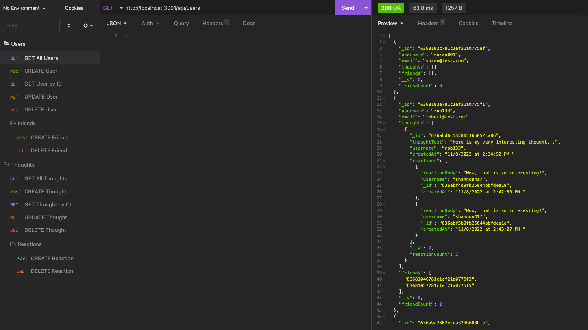

# Socialize API

## Description

The Socialize API is an API for a social network web application. It uses Express.js for routing, a MongoDB database for unstructured data, and the Mongoose ODM. It allows users to create a list of friends, share their thoughts, and respond to the thoughts of their friends with reactions. This is not a deployed application so please see the walkthrough video demonstrating the API routes in Insomnia.

## Table of Contents

- [Installation](#installation)
- [Usage](#usage)
- [License](#license)
- [Contributing](#contributing)
- [Tests](#tests)
- [Questions](#questions)

## Installation 

This application uses Node.js, Express.js, and Mongoose.

* Please use `npm i` to install the required packages.

* `npm start` will invoke the application by starting the server and syncing the Mongoose models to the MongoDB database named 'socializeDB'.

* The API routes may be tested in Insomnia.

## Usage 

After installing the required packages and starting the application, the socializeDB is synced with the models and routes are ready to be tested in Insomnia.

The user routes include API GET routes for all users and for a single user.

* Getting all users returns formatted JSON data that includes each user's ID, username, email, their thoughts, friends, and friend count.

* Getting a user by their user ID returns only that user's data.

Additionally, there are user routes for creating, updating, and deleting a user.

* A POST route for creating a user requires the input of a username and email.

* A PUT route for updating a user allows for updating a username, email, or both. The user ID is passed into the URL parameters.

* Likewise, a user ID passed into a DELETE route will delete a user and the user's thoughts from the database. 

Adding and deleting a friend from a user's friends list is accomplished by passing in a user's ID and the friend's user ID into POST and DELETE routes, respectively. 

In the same way as GET routes for the user, all thoughts and single thougts are returned in JSON format. Thoughts can be created, updated, and deleted.

* The data included for thoughts is thought ID, thought text, username, reactions, date created, and the reaction count.

* A POST route for creating a thought requires the input of the user ID, username, and thought text. The thought is added to the user's thoughts list.

* The tought text can be edited in the PUT route for updating a thought, with the thought ID getting passed into the URL parameters.

* Thoughts can be deleted by passing the thought ID into the URL parameters of the DELETE route.

To create a reaction to a thought, the thought ID is passed into the URL paramters and a reaction body and username are supplied. The reaction is added to the list of reactions within a thought.

* Formatted JSON data for reactions includes the user's ID, reaction body, username, reaction ID, and the date created.

To delete a reaction, the thought ID and reaction ID are passed into the URL parameters. This removes the reaction from the list of reactions within a thought.

[Walkthrough Video](https://drive.google.com/file/d/1aXmvgnyq1UdQCDToEP7sNi3yuqU238BY/view)

## License 

The Socialize API is available under the MIT license.

Please see [LICENSE](./LICENSE) for the full details of the license.

## Contributing 

The contributors of this application have adopted the Contributor Covenant Code of Conduct. Please visit the [Code of Conduct](./CODE_OF_CONDUCT) page for details.

## Tests 

This application doesn't have any tests at this time.

## Questions 

Please reach out via the the link below with any additional questions. 

[GitHub](https://github.com/smdann)
